# Florence with Locals - Comprehensive Codebase Analysis

## Executive Summary

Florence with Locals is a tour management system designed for tour operators in Florence, Italy. This document provides an in-depth analysis of the codebase from three critical perspectives: Software Architecture, Software Development, and Product Management.

## Table of Contents

1. [Software Architecture Perspective](#software-architecture-perspective)
2. [Software Developer Perspective](#software-developer-perspective)
3. [Product Manager Perspective](#product-manager-perspective)
4. [Technical Deep Dive](#technical-deep-dive)
5. [Recommendations and Future Roadmap](#recommendations-and-future-roadmap)

---

## Software Architecture Perspective

### System Architecture Overview

The application follows a traditional three-tier architecture with clear separation of concerns:

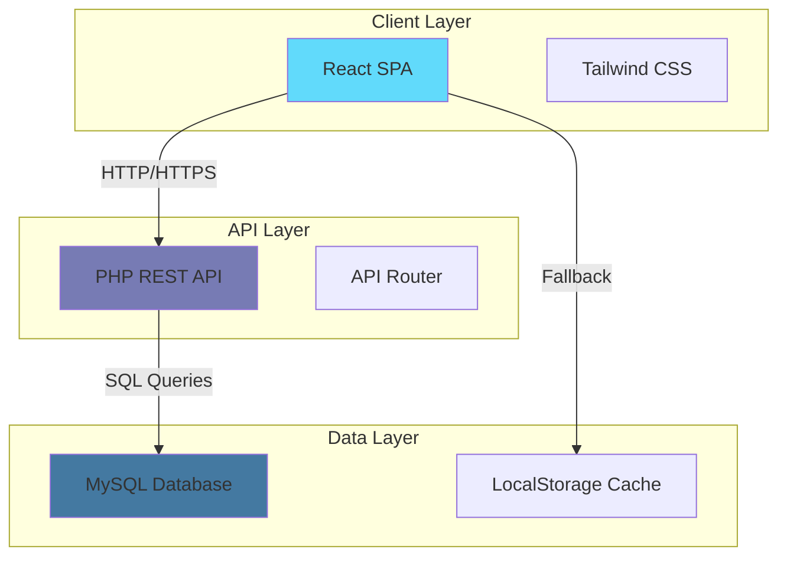
```mermaid
graph TB
    subgraph "Client Layer"
        React[React SPA]
        TailwindCSS[Tailwind CSS]
    end
    
    subgraph "API Layer"
        PHP[PHP REST API]
        Router[API Router]
    end
    
    subgraph "Data Layer"
        MySQL[MySQL Database]
        LocalStorage[LocalStorage Cache]
    end
    
    React -->|HTTP/HTTPS| PHP
    PHP -->|SQL Queries| MySQL
    React -->|Fallback| LocalStorage
    
    style React fill:#61DAFB
    style PHP fill:#777BB4
    style MySQL fill:#4479A1
```

### Architecture Patterns

#### 1. **Client-Server Architecture**
- **Frontend**: React Single Page Application (SPA)
- **Backend**: PHP RESTful API
- **Database**: MySQL relational database
- **Communication**: RESTful HTTP/HTTPS with JSON payloads

#### 2. **Component-Based Architecture (Frontend)**
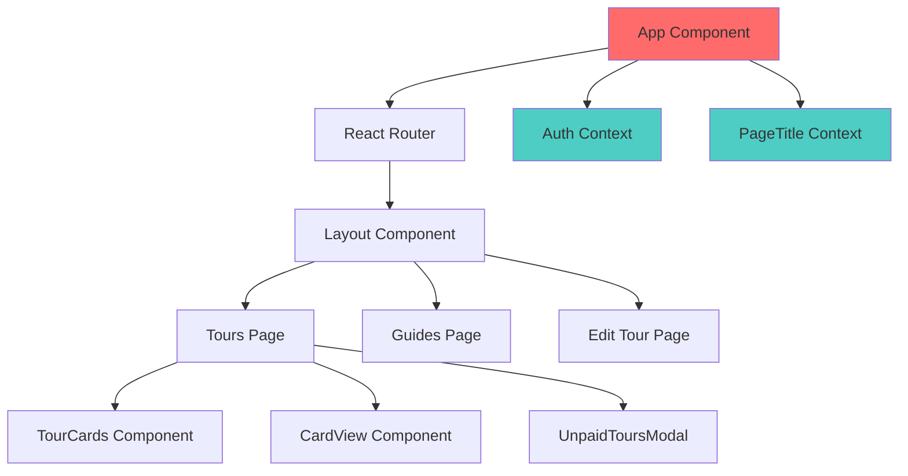
```mermaid
graph TD
    App[App Component]
    App --> Router[React Router]
    Router --> Layout[Layout Component]
    Layout --> Tours[Tours Page]
    Layout --> Guides[Guides Page]
    Layout --> EditTour[Edit Tour Page]
    
    Tours --> TourCards[TourCards Component]
    Tours --> CardView[CardView Component]
    Tours --> UnpaidToursModal[UnpaidToursModal]
    
    App --> AuthContext[Auth Context]
    App --> PageTitleContext[PageTitle Context]
    
    style App fill:#FF6B6B
    style AuthContext fill:#4ECDC4
    style PageTitleContext fill:#4ECDC4
```

#### 3. **Data Flow Architecture**
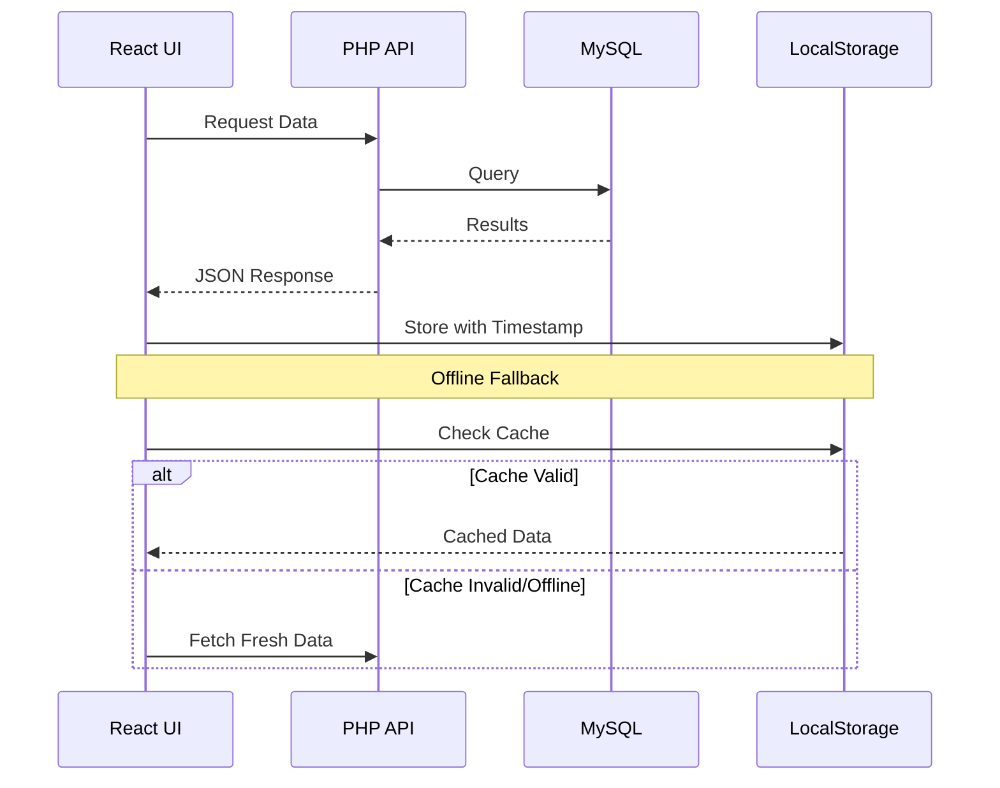
```mermaid
sequenceDiagram
    participant UI as React UI
    participant API as PHP API
    participant DB as MySQL
    participant Cache as LocalStorage
    
    UI->>API: Request Data
    API->>DB: Query
    DB-->>API: Results
    API-->>UI: JSON Response
    UI->>Cache: Store with Timestamp
    
    Note over UI,Cache: Offline Fallback
    UI->>Cache: Check Cache
    alt Cache Valid
        Cache-->>UI: Cached Data
    else Cache Invalid/Offline
        UI->>API: Fetch Fresh Data
    end
```

### Technology Stack Analysis

#### Frontend Stack
- **React 18**: Modern UI library with hooks and functional components
- **Tailwind CSS**: Utility-first CSS framework for rapid UI development
- **React Router v7**: Client-side routing for SPA navigation
- **date-fns**: Lightweight date manipulation library
- **axios**: Promise-based HTTP client

#### Backend Stack
- **PHP 7.4+**: Server-side scripting language
- **MySQL**: Relational database management system
- **Apache/.htaccess**: Web server with URL rewriting

#### Development Tools
- **Vite**: Next-generation frontend build tool
- **PostCSS**: CSS transformation tool
- **Concurrently**: Run multiple npm scripts simultaneously

### Architectural Decisions and Rationale

1. **SPA vs MPA**: Chose SPA for better user experience and reduced server load
2. **PHP Backend**: Leverages existing hosting infrastructure and team expertise
3. **LocalStorage Caching**: Provides offline capability and improves performance
4. **Component Isolation**: Each component has single responsibility
5. **Context API**: Manages global state without external dependencies

### Security Architecture

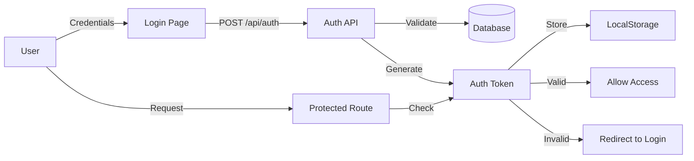
```mermaid
graph LR
    User[User] -->|Credentials| Login[Login Page]
    Login -->|POST /api/auth| AuthAPI[Auth API]
    AuthAPI -->|Validate| DB[(Database)]
    AuthAPI -->|Generate| Token[Auth Token]
    Token -->|Store| LocalStorage[LocalStorage]
    
    User -->|Request| ProtectedRoute[Protected Route]
    ProtectedRoute -->|Check| Token
    Token -->|Valid| Allow[Allow Access]
    Token -->|Invalid| Redirect[Redirect to Login]
```

---

## Software Developer Perspective

### Code Organization and Structure

```
guide-florence-with-locals/
├── src/                        # Frontend source code
│   ├── components/            # Reusable UI components
│   ├── pages/                # Page-level components
│   ├── services/             # API communication layer
│   ├── contexts/             # React Context providers
│   └── assets/               # Static assets
├── public_html/              # PHP API and static files
│   ├── api/                  # REST API endpoints
│   └── guide/                # Utility pages
├── backend/                  # Node.js backend (unused)
├── dist/                     # Production build output
└── server/                   # Development server
```

### Code Quality Analysis

#### Strengths
1. **Clear Component Hierarchy**: Well-organized component structure
2. **Separation of Concerns**: Business logic separated from presentation
3. **Reusable Components**: TourCards, CardView promote code reuse
4. **Error Handling**: Comprehensive try-catch blocks throughout
5. **Type Safety**: PropTypes could be added for better type checking

#### Code Patterns and Best Practices

##### 1. **Custom Hooks Pattern**
```javascript
// Example: usePageTitle hook usage
const { setPageTitle } = usePageTitle();

useEffect(() => {
    setPageTitle('Tours Dashboard');
    return () => setPageTitle('');
}, [setPageTitle]);
```

##### 2. **Service Layer Pattern**
```javascript
// mysqlDB.js service layer
export const getTours = async (forceRefresh = false) => {
    // Cache management
    // API calls
    // Error handling
    // Fallback logic
};
```

##### 3. **Component Composition**
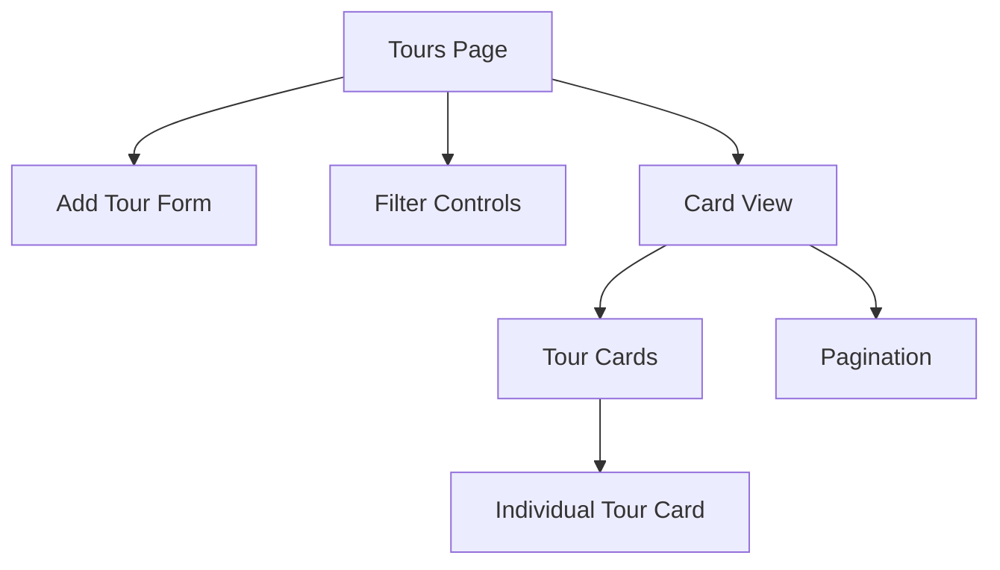
```mermaid
graph TD
    Tours[Tours Page]
    Tours --> AddTourForm[Add Tour Form]
    Tours --> FilterControls[Filter Controls]
    Tours --> CardView[Card View]
    CardView --> TourCards[Tour Cards]
    CardView --> Pagination[Pagination]
    TourCards --> TourCard[Individual Tour Card]
```

### API Design and Implementation

#### RESTful Endpoints
```
GET    /api/guides              # List all guides
POST   /api/guides              # Create new guide
DELETE /api/guides/:id          # Delete guide

GET    /api/tours               # List all tours
POST   /api/tours               # Create new tour
PUT    /api/tours/:id           # Update tour
DELETE /api/tours/:id           # Delete tour
PUT    /api/tours/:id/paid      # Update payment status
PUT    /api/tours/:id/cancelled # Update cancellation status

POST   /api/auth                # User authentication
```

#### Database Schema
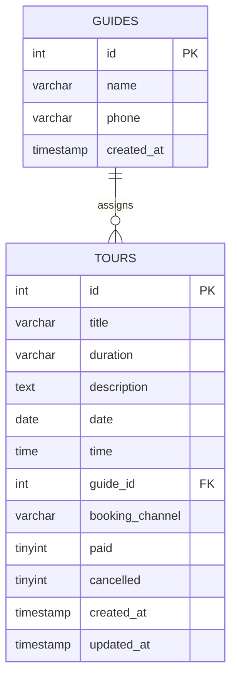
```mermaid
erDiagram
    GUIDES ||--o{ TOURS : assigns
    GUIDES {
        int id PK
        varchar name
        varchar phone
        timestamp created_at
    }
    TOURS {
        int id PK
        varchar title
        varchar duration
        text description
        date date
        time time
        int guide_id FK
        varchar booking_channel
        tinyint paid
        tinyint cancelled
        timestamp created_at
        timestamp updated_at
    }
```

### State Management Architecture

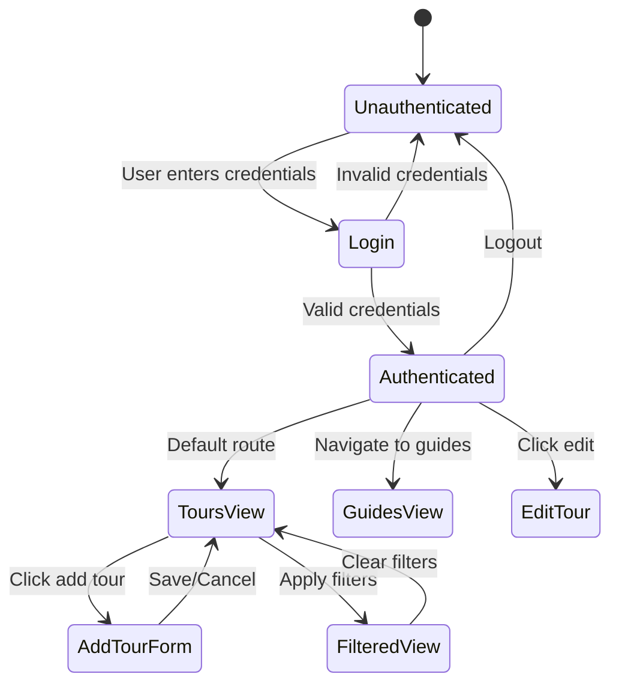
```mermaid
stateDiagram-v2
    [*] --> Unauthenticated
    Unauthenticated --> Login: User enters credentials
    Login --> Authenticated: Valid credentials
    Login --> Unauthenticated: Invalid credentials
    
    Authenticated --> ToursView: Default route
    Authenticated --> GuidesView: Navigate to guides
    Authenticated --> EditTour: Click edit
    
    ToursView --> AddTourForm: Click add tour
    AddTourForm --> ToursView: Save/Cancel
    
    ToursView --> FilteredView: Apply filters
    FilteredView --> ToursView: Clear filters
    
    Authenticated --> Unauthenticated: Logout
```

### Performance Considerations

1. **Caching Strategy**
   - LocalStorage with timestamp-based expiration
   - Version-based cache invalidation
   - Force refresh capability

2. **Pagination**
   - Client-side pagination for loaded data
   - Configurable items per page (10, 20, 50, 100)

3. **Lazy Loading**
   - Components loaded on-demand via React Router
   - Reduced initial bundle size

### Development Workflow

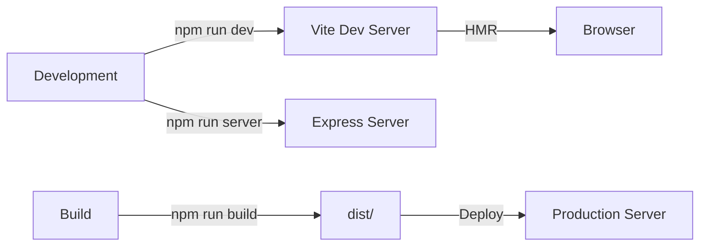
```mermaid
graph LR
    Dev[Development] -->|npm run dev| Vite[Vite Dev Server]
    Dev -->|npm run server| Express[Express Server]
    Vite -->|HMR| Browser[Browser]
    
    Build[Build] -->|npm run build| Dist[dist/]
    Dist -->|Deploy| Production[Production Server]
```

---

## Product Manager Perspective

### Product Overview

Florence with Locals is a B2B SaaS solution for tour operators managing guided tours in Florence, Italy. The platform streamlines tour scheduling, guide assignment, and payment tracking.

### User Personas

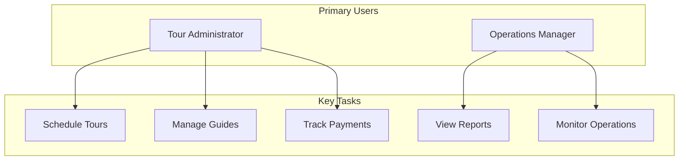
```mermaid
graph TD
    subgraph "Primary Users"
        Admin[Tour Administrator]
        Manager[Operations Manager]
    end
    
    subgraph "Key Tasks"
        Admin --> ScheduleTours[Schedule Tours]
        Admin --> ManageGuides[Manage Guides]
        Admin --> TrackPayments[Track Payments]
        Manager --> ViewReports[View Reports]
        Manager --> MonitorOperations[Monitor Operations]
    end
```

### Core Features and User Flows

#### 1. **Tour Management Flow**
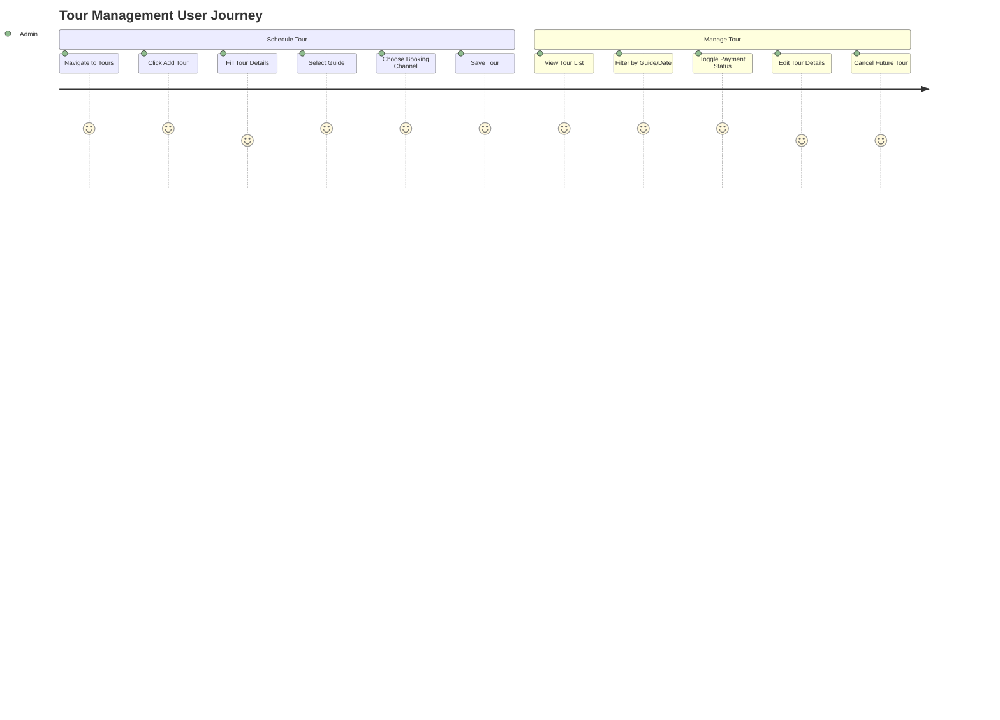
```mermaid
journey
    title Tour Management User Journey
    section Schedule Tour
      Navigate to Tours: 5: Admin
      Click Add Tour: 5: Admin
      Fill Tour Details: 4: Admin
      Select Guide: 5: Admin
      Choose Booking Channel: 5: Admin
      Save Tour: 5: Admin
    section Manage Tour
      View Tour List: 5: Admin
      Filter by Guide/Date: 5: Admin
      Toggle Payment Status: 5: Admin
      Edit Tour Details: 4: Admin
      Cancel Future Tour: 4: Admin
```

#### 2. **Guide Management Flow**
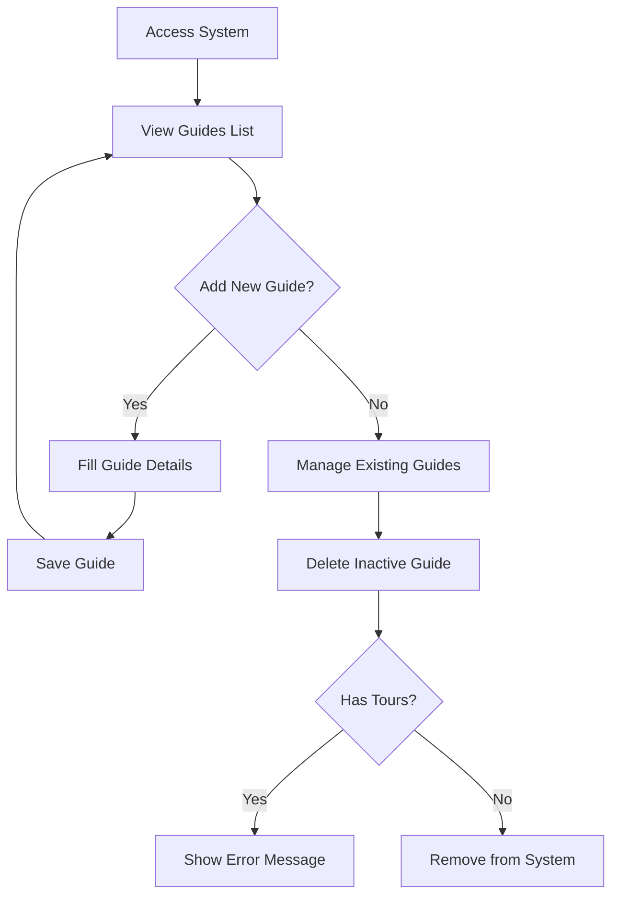
```mermaid
flowchart TD
    Start[Access System] --> ViewGuides[View Guides List]
    ViewGuides --> AddGuide{Add New Guide?}
    AddGuide -->|Yes| FillDetails[Fill Guide Details]
    FillDetails --> SaveGuide[Save Guide]
    SaveGuide --> ViewGuides
    AddGuide -->|No| ManageExisting[Manage Existing Guides]
    ManageExisting --> DeleteGuide[Delete Inactive Guide]
    DeleteGuide --> CheckTours{Has Tours?}
    CheckTours -->|Yes| ShowError[Show Error Message]
    CheckTours -->|No| RemoveGuide[Remove from System]
```

### Feature Analysis

#### Current Features
1. **Tour Scheduling**: Comprehensive tour creation with all necessary details
2. **Guide Assignment**: Link tours to specific guides
3. **Booking Channel Tracking**: Monitor tour sources (NEW)
4. **Payment Management**: Track paid/unpaid status
5. **Tour Cancellation**: Soft delete for record keeping
6. **Filtering System**: By guide and date
7. **Visual Status Indicators**: Color-coded tour cards

#### Feature Value Matrix
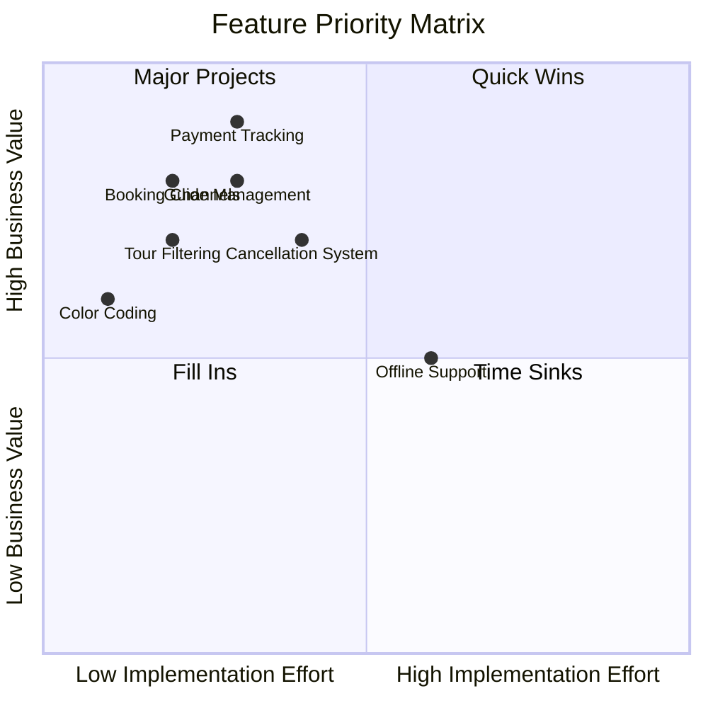
```mermaid
quadrantChart
    title Feature Priority Matrix
    x-axis Low Implementation Effort --> High Implementation Effort
    y-axis Low Business Value --> High Business Value
    quadrant-1 Quick Wins
    quadrant-2 Major Projects
    quadrant-3 Fill Ins
    quadrant-4 Time Sinks
    "Payment Tracking": [0.3, 0.9]
    "Booking Channels": [0.2, 0.8]
    "Tour Filtering": [0.2, 0.7]
    "Color Coding": [0.1, 0.6]
    "Cancellation System": [0.4, 0.7]
    "Offline Support": [0.6, 0.5]
    "Guide Management": [0.3, 0.8]
```

### Business Metrics and KPIs

#### Operational Metrics
- **Tours Scheduled**: Total number of tours in system
- **Active Guides**: Number of guides with assigned tours
- **Payment Rate**: Percentage of completed tours marked as paid
- **Booking Sources**: Distribution across channels
- **Cancellation Rate**: Percentage of cancelled tours

#### System Usage Metrics
- **Daily Active Users**: Admin accessing the system
- **Feature Adoption**: Usage of filtering, booking channels
- **Error Rate**: Failed operations or system errors

### Competitive Analysis

| Feature | Florence with Locals | Generic Tour Systems |
|---------|---------------------|---------------------|
| Booking Channel Tracking | ✅ Implemented | ❌ Often Missing |
| Offline Capability | ✅ LocalStorage Fallback | ❌ Requires Internet |
| Visual Status System | ✅ Color-coded | ⚠️ Basic Lists |
| Payment Tracking | ✅ Integrated | ⚠️ Separate System |
| Mobile Responsive | ✅ Full Support | ⚠️ Limited |

### Product Roadmap Opportunities

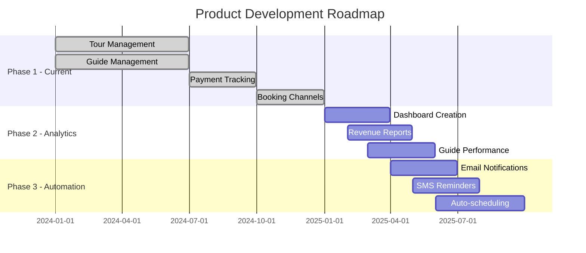
```mermaid
gantt
    title Product Development Roadmap
    dateFormat YYYY-MM-DD
    section Phase 1 - Current
        Tour Management     :done, 2024-01-01, 2024-06-30
        Guide Management    :done, 2024-01-01, 2024-06-30
        Payment Tracking    :done, 2024-07-01, 2024-09-30
        Booking Channels    :done, 2024-10-01, 2024-12-31
    section Phase 2 - Analytics
        Dashboard Creation  :2025-01-01, 2025-03-31
        Revenue Reports     :2025-02-01, 2025-04-30
        Guide Performance   :2025-03-01, 2025-05-31
    section Phase 3 - Automation
        Email Notifications :2025-04-01, 2025-06-30
        SMS Reminders       :2025-05-01, 2025-07-31
        Auto-scheduling     :2025-06-01, 2025-09-30
```

---

## Technical Deep Dive

### Frontend Architecture Details

#### Component Hierarchy and Data Flow
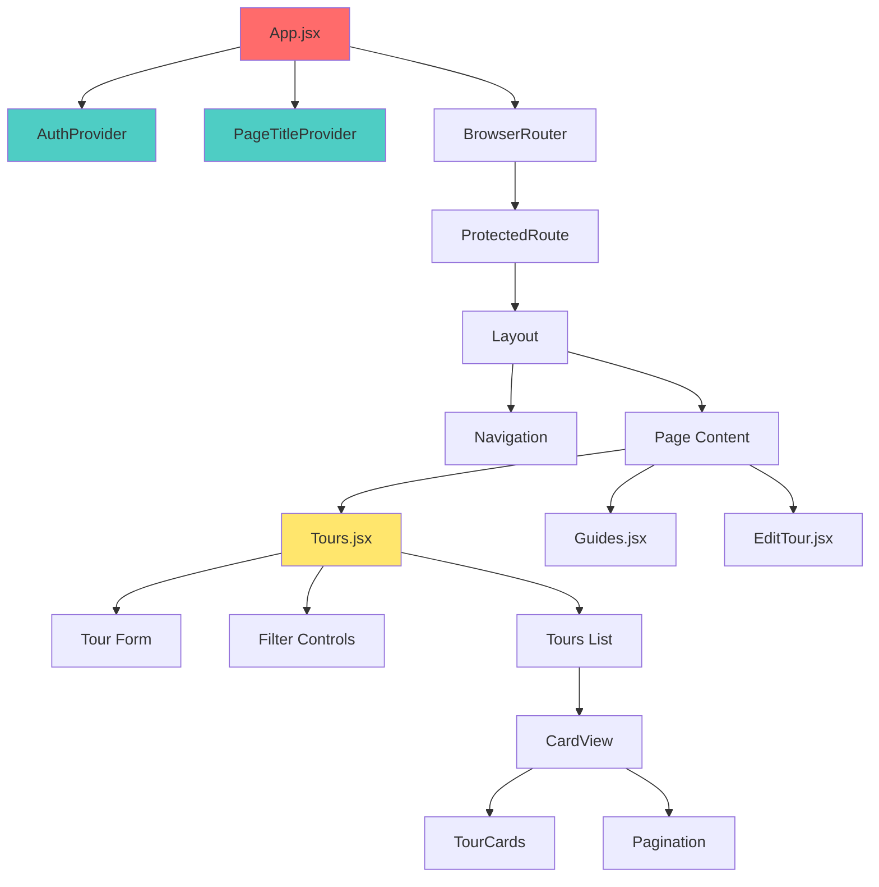
```mermaid
graph TD
    App[App.jsx]
    App --> AuthProvider[AuthProvider]
    App --> PageTitleProvider[PageTitleProvider]
    App --> Router[BrowserRouter]
    
    Router --> ProtectedRoute[ProtectedRoute]
    ProtectedRoute --> Layout[Layout]
    
    Layout --> Navigation[Navigation]
    Layout --> PageContent[Page Content]
    
    PageContent --> Tours[Tours.jsx]
    PageContent --> Guides[Guides.jsx]
    PageContent --> EditTour[EditTour.jsx]
    
    Tours --> TourForm[Tour Form]
    Tours --> FilterControls[Filter Controls]
    Tours --> ToursList[Tours List]
    
    ToursList --> CardView[CardView]
    CardView --> TourCards[TourCards]
    CardView --> Pagination[Pagination]
    
    style App fill:#FF6B6B
    style AuthProvider fill:#4ECDC4
    style PageTitleProvider fill:#4ECDC4
    style Tours fill:#FFE66D
```

#### State Management Strategy

1. **Context API Usage**
   - `AuthContext`: Manages authentication state globally
   - `PageTitleContext`: Manages dynamic page titles

2. **Component State**
   - Form data managed locally in components
   - Pagination state maintained in parent components
   - Filter state lifted to container components

3. **Data Fetching Pattern**
```javascript
// Consistent pattern across components
const fetchData = async () => {
    try {
        setIsLoading(true);
        const data = await serviceCall();
        setData(data);
        setError(null);
    } catch (err) {
        setError('Error message');
    } finally {
        setIsLoading(false);
    }
};
```

### Backend Architecture Details

#### API Request Flow
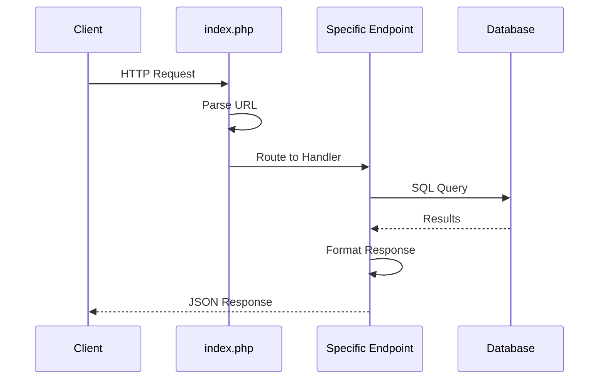
```mermaid
sequenceDiagram
    participant Client
    participant Router as index.php
    participant Endpoint as Specific Endpoint
    participant DB as Database
    
    Client->>Router: HTTP Request
    Router->>Router: Parse URL
    Router->>Endpoint: Route to Handler
    Endpoint->>DB: SQL Query
    DB-->>Endpoint: Results
    Endpoint->>Endpoint: Format Response
    Endpoint-->>Client: JSON Response
```

#### Database Operations

1. **Connection Management**
   - Single connection per request
   - Prepared statements for security
   - Proper connection cleanup

2. **Schema Evolution**
   - Automatic column addition
   - Backward compatibility maintained
   - No manual migrations required

### Caching and Performance

#### Cache Architecture
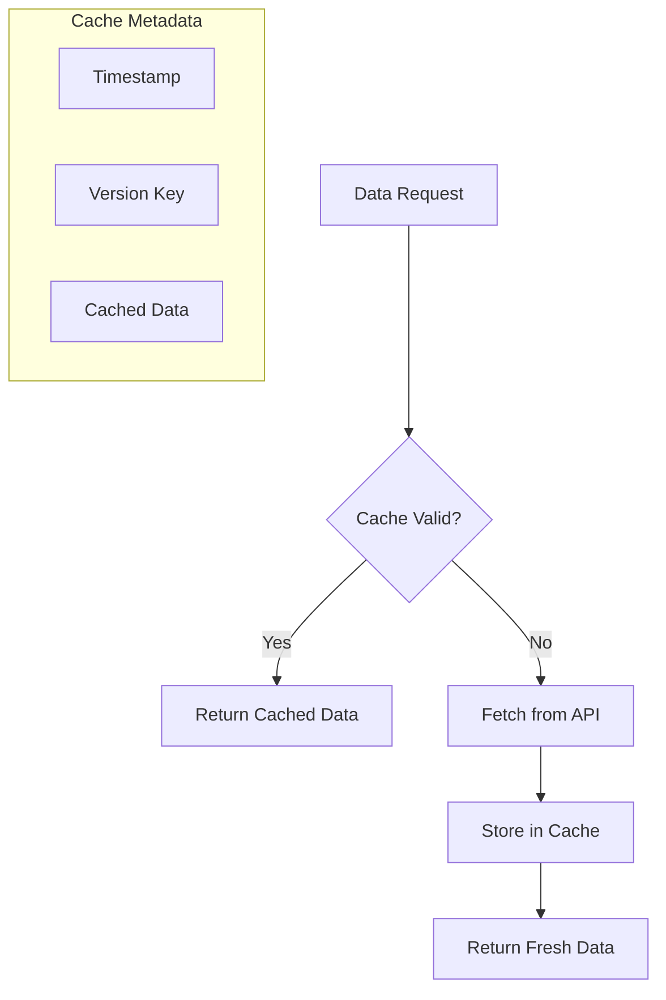
```mermaid
graph TD
    Request[Data Request] --> CheckCache{Cache Valid?}
    CheckCache -->|Yes| ReturnCache[Return Cached Data]
    CheckCache -->|No| FetchAPI[Fetch from API]
    FetchAPI --> StoreCache[Store in Cache]
    StoreCache --> ReturnData[Return Fresh Data]
    
    subgraph "Cache Metadata"
        Timestamp[Timestamp]
        Version[Version Key]
        Data[Cached Data]
    end
```

#### Performance Optimizations

1. **Frontend Optimizations**
   - Component memoization where applicable
   - Efficient re-rendering strategies
   - Bundling and code splitting with Vite

2. **Backend Optimizations**
   - Indexed database queries
   - Minimal data transfer
   - Efficient JSON encoding

### Security Implementation

#### Authentication Flow
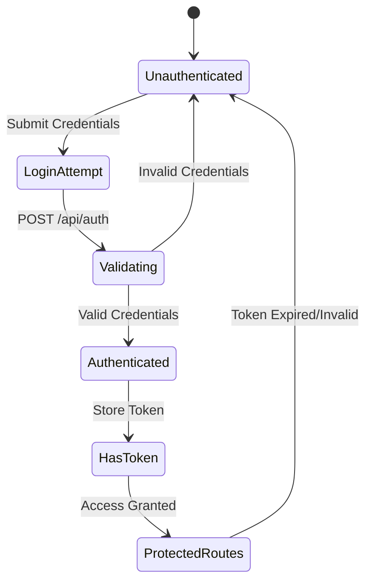
```mermaid
stateDiagram-v2
    [*] --> Unauthenticated
    Unauthenticated --> LoginAttempt: Submit Credentials
    LoginAttempt --> Validating: POST /api/auth
    Validating --> Authenticated: Valid Credentials
    Validating --> Unauthenticated: Invalid Credentials
    Authenticated --> HasToken: Store Token
    HasToken --> ProtectedRoutes: Access Granted
    ProtectedRoutes --> Unauthenticated: Token Expired/Invalid
```

#### Security Measures

1. **Frontend Security**
   - Protected routes with auth checks
   - Token stored in localStorage
   - Automatic redirect on auth failure

2. **Backend Security**
   - SQL injection prevention via prepared statements
   - CORS headers properly configured
   - Input validation and sanitization

---

## Recommendations and Future Roadmap

### Immediate Improvements (0-3 months)

#### Technical Debt
1. **Add TypeScript**: Improve type safety and developer experience
2. **Implement Testing**: Unit tests for components and API endpoints
3. **Error Boundary**: Global error handling for better UX
4. **API Versioning**: Prepare for future API changes

#### Feature Enhancements
1. **Advanced Filtering**: Multiple filter combinations
2. **Bulk Operations**: Select multiple tours for actions
3. **Export Functionality**: Download tour/payment data
4. **Search Capability**: Full-text search across tours

### Medium-term Goals (3-6 months)

#### Architecture Evolution
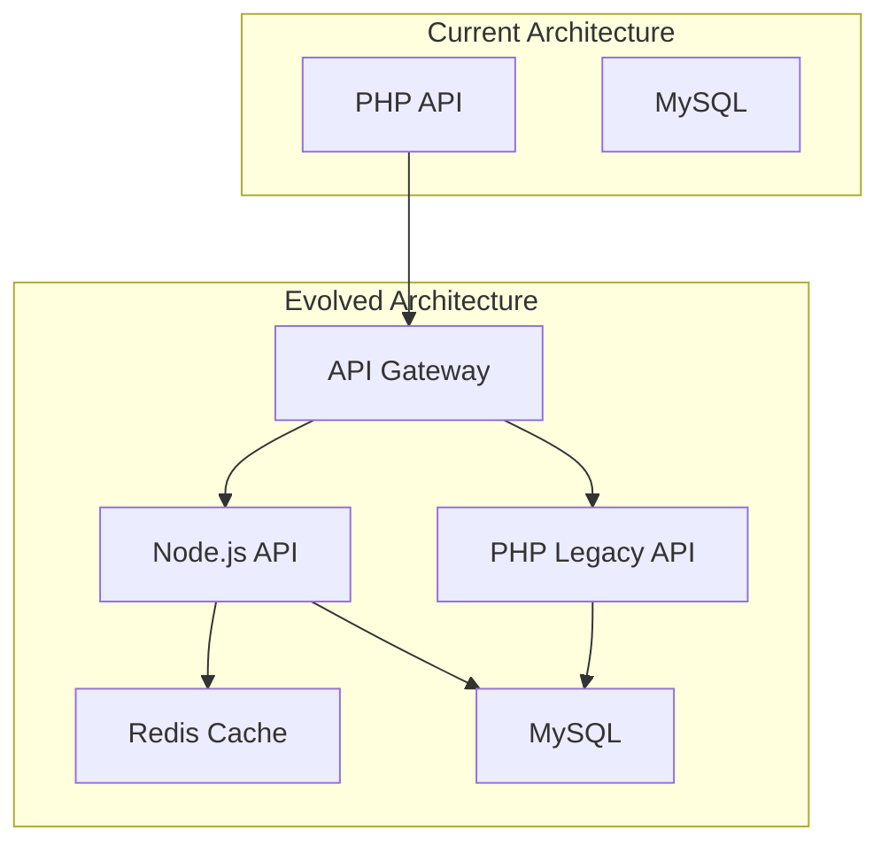
```mermaid
graph TD
    subgraph "Current Architecture"
        CurrentPHP[PHP API]
        CurrentMySQL[MySQL]
    end
    
    subgraph "Evolved Architecture"
        APIGateway[API Gateway]
        NodeAPI[Node.js API]
        PHPLegacy[PHP Legacy API]
        Redis[Redis Cache]
        MySQL2[MySQL]
    end
    
    CurrentPHP --> APIGateway
    APIGateway --> NodeAPI
    APIGateway --> PHPLegacy
    NodeAPI --> Redis
    NodeAPI --> MySQL2
    PHPLegacy --> MySQL2
```

#### New Features
1. **Analytics Dashboard**: Visual insights into operations
2. **Automated Reporting**: Scheduled email reports
3. **Multi-language Support**: Italian/English interface
4. **Guide Portal**: Separate access for guides

### Long-term Vision (6-12 months)

#### Platform Evolution
1. **Mobile Application**: Native iOS/Android apps
2. **Real-time Updates**: WebSocket integration
3. **AI Integration**: Smart scheduling suggestions
4. **Payment Gateway**: Direct payment processing

#### Business Expansion
1. **Multi-city Support**: Expand beyond Florence
2. **White-label Solution**: Customizable for other operators
3. **Marketplace Features**: Guide availability calendar
4. **Customer Portal**: Tour booking for end customers

### Technical Recommendations

#### Code Quality
1. **Establish Coding Standards**: ESLint, Prettier configuration
2. **Documentation**: JSDoc for all functions
3. **Component Library**: Storybook for UI components
4. **CI/CD Pipeline**: Automated testing and deployment

#### Performance
1. **Image Optimization**: Lazy loading for tour images
2. **Database Indexing**: Optimize query performance
3. **CDN Integration**: Static asset delivery
4. **API Caching**: Redis for frequently accessed data

#### Monitoring
1. **Application Monitoring**: Sentry for error tracking
2. **Analytics**: Google Analytics or Plausible
3. **Performance Monitoring**: Web Vitals tracking
4. **Uptime Monitoring**: Service availability checks

### Risk Mitigation

| Risk | Impact | Mitigation Strategy |
|------|--------|-------------------|
| Data Loss | High | Automated backups, replication |
| Security Breach | High | Regular security audits, updates |
| Scalability Issues | Medium | Load testing, architecture review |
| Technical Debt | Medium | Regular refactoring sprints |
| Feature Creep | Low | Clear product roadmap, priorities |

### Conclusion

Florence with Locals demonstrates solid foundational architecture with room for strategic improvements. The codebase shows thoughtful design decisions, particularly in state management and user experience. The recent addition of booking channel tracking shows the product's evolution based on business needs.

Key strengths include the offline-capable architecture, clean component structure, and comprehensive error handling. Areas for improvement include adding type safety, implementing automated testing, and preparing for scale.

The product serves its target market well, with opportunities to expand functionality and reach. The technical foundation supports future growth, though some architectural evolution will be beneficial as the platform scales.

---

*Document Version: 1.0*  
*Last Updated: January 2025*  
*Prepared for: Florence with Locals Development Team* 